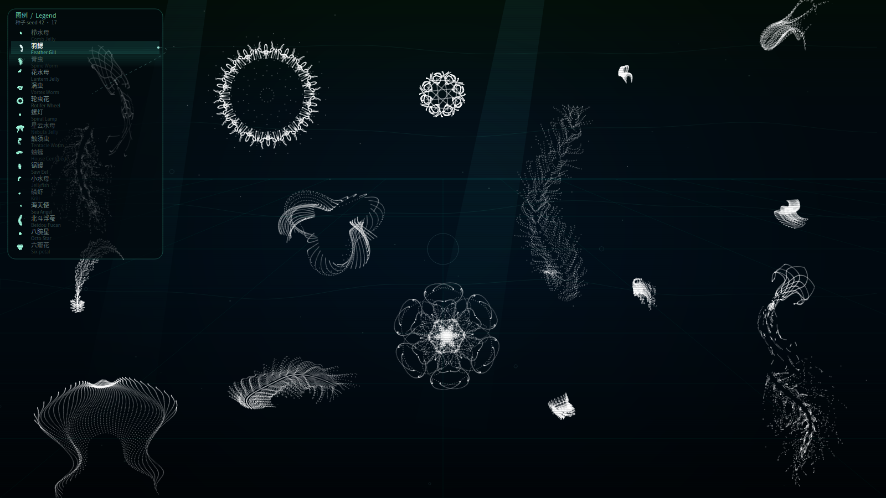
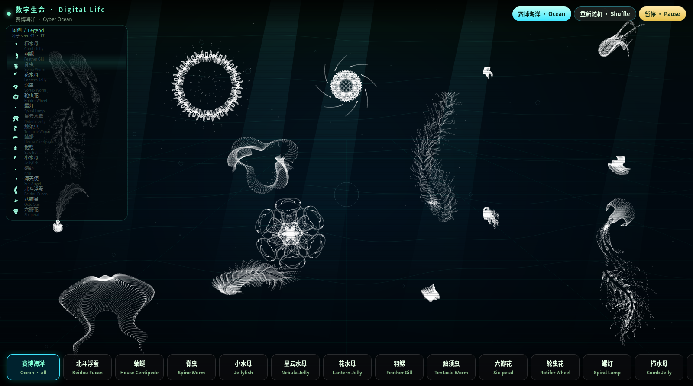

# 赛博海洋馆屏幕保护 / Cyber Ocean Screensaver

赛博海洋馆是一款跨平台**屏幕保护程序**和**动态壁纸**：公式生成的浮蚕、水母、栉水母、磷虾、海天使在深蓝海里游动，白点勾勒，互相躲开。支持 Linux AppImage、Windows `.scr`、macOS。

**Cyber Ocean Screensaver** is a cross-platform **screensaver** and **live wallpaper**. Parametric sea-life — jellyfish, comb jellies, krill, worms, sea angels — swim as white particles on deep navy water. Linux, Windows, and macOS. Python gallery plus a native Rust / wgpu engine.

## 截图 / Screenshots



*屏保 / 壁纸模式：左上角图例为中英对照，剪影随生物一起游动。*  
*Screensaver / wallpaper: bilingual legend, live silhouettes, lock-on line to the highlighted creature.*



*集合馆：顶栏、底栏与图例均为中英双语。点击图例可点亮对应生物。*  
*Gallery HUD is bilingual. Click a legend row to pulse that creature.*

## 快速开始 / Quick start

```bash
git clone https://github.com/blueanima/cyber-ocean-screensaver.git
cd cyber-ocean-screensaver
python3 main.py --screensaver
```

移动鼠标或按任意键退出。Move the mouse or press any key to exit.

Linux 屏保会铺满整个屏幕（系统全屏窗口，没有地址栏和标签页）。  
The Linux screensaver covers the whole screen in a native fullscreen window — not a browser tab.

| 命令 Command | 中文 | English |
| --- | --- | --- |
| `python3 main.py --screensaver` | 屏幕保护（键鼠退出） | Screensaver (input exits) |
| `python3 main.py --wallpaper` | 壁纸 / 展览（键鼠不退出） | Wallpaper / exhibit (input stays) |
| `python3 main.py` | 集合馆、赛博海洋、分步讲解 | Gallery, ocean, step-by-step lesson |

集合馆仍可用浏览器打开。屏保模式不再弹出网页标签。  
Gallery still uses a browser. Screensaver mode does not open a web page.

## 成品包 / Ready-made builds

GitHub Actions 会在打 `v*` 标签或手动 Run workflow 后生成：

| 文件 File | 说明 |
| --- | --- |
| `CyberOcean-*-x86_64.AppImage` | Linux 可直接运行（内置 Python） |
| `CyberOcean-portable-*.zip` | 跨平台源码包 + 启动脚本 + 离线 HTML |
| `CyberOcean.scr` | Windows 屏幕保护 |
| `screensaver.html` / `wallpaper.html` | 双击用浏览器打开 |

本地打包：

```bash
chmod +x scripts/build-release.sh packaging/AppRun
./scripts/build-release.sh                 # 已发布过的版本会自动升补丁号
./dist/CyberOcean-*-x86_64.AppImage          # 屏保
./dist/CyberOcean-*-x86_64.AppImage --gallery
./dist/CyberOcean-*-x86_64.AppImage --wallpaper
```

GitHub 直连失败时，脚本会走 `gh` API 或 `ghfast.top` 镜像。只要系统已有 Python 3.10+，也可以 `SYSTEM_PYTHON=1 ./scripts/build-release.sh`。

AppImage 默认进入 **wgpu 原生全屏屏保**（公式在 CPU 里算，点粒在 GPU 上画）。集合馆用 `--gallery`。  
The AppImage default is a native wgpu fullscreen saver. Use `--gallery` for the browser gallery.

本地编译原生屏保：

```bash
cd native
cargo build --release
../native/target/release/cyber-ocean-native          # 全屏
../native/target/release/cyber-ocean-native --windowed
python3 main.py --screensaver                         # 启动前弹出设置，点「开始」
python3 main.py --screensaver --no-setup              # 空闲屏保：直接全屏
python3 main.py --config                              # 只改设置，不启动
python3 main.py --screensaver --quality medium        # 本次覆盖
```

运行中在海洋画面上**点右键**会再次弹出设置；点「应用」立即生效。Esc 先关设置窗，再按退出屏保。

画质预设（也可写进 `~/.config/cyber-ocean/settings.json`）：

| 预设 | 密度 step | 帧率 | 生物数 | 图例 |
| --- | --- | --- | --- | --- |
| `low` | 4（疏） | 24 | 12 | 1/4 点 |
| `medium` | 2 | 30 | 17 | 1/2 点 |
| `high`（默认） | 1（密） | 30 | 17 | 全点 |
| `ultra` | 1 | 60 | 17 | 全点 |

可单独调：`--step` `--fps` `--count` `--point-size` `--legend-stride` `--no-legend` `--no-vsync`。原生二进制 `--help` / `--print-config` 会列出当前生效值。


## 图例怎么读 / How to read the legend

左上角 **图例 / Legend** 列出当前海里的每只公式生物：

- 左侧小剪影与海里的个体同步摆动  
- 中文名 + 英文名  
- 指针靠近，或点选图例，会高亮并用虚线连过去  
- 屏保模式下图例会自动轮询点名  

The **Legend** (top-left) lists every creature in the tank: a live mini silhouette, Chinese + English names, a dashed lock-on when highlighted, and an auto-scan in screensaver mode.

## 生物名录 / Species

| 中文 | English | 备注 Notes |
| --- | --- | --- |
| 北斗浮蚕 | Beidou Fucan | 海报公式 / poster formula |
| 蚰蜒 | House Centipede | yuruyurau · life 1 |
| 脊虫 | Spine Worm | life 2 |
| 小水母 | Jellyfish | life 3 |
| 星云水母 | Nebula Jelly | life 4 |
| 花水母 | Lantern Jelly | life 5 |
| 羽鳃 | Feather Gill | life 6 |
| 触须虫 | Tentacle Worm | life 7 |
| 六瓣花 | Six-petal | life 8 |
| 轮虫花 | Rotifer Wheel | life 9 |
| 螺灯 | Spiral Lamp | 原创 / original |
| 栉水母 | Comb Jelly | 原创 / original |
| 锯鳗 | Saw Eel | 原创 / original |
| 八腕星 | Octo Star | 原创 / original |
| 磷虾 | Krill | 原创 / original |
| 涡虫 | Vortex Worm | 原创 / original |
| 海天使 | Sea Angel | 原创 / original |

## 安装 / Install

### Linux

```bash
chmod +x scripts/install-linux.sh
./scripts/install-linux.sh
cyber-ocean-screensaver
```

空闲启动 Idle hook：`swayidle -w timeout 180 'cyber-ocean-screensaver'`

### macOS

```bash
chmod +x scripts/install-macos.sh
./scripts/install-macos.sh
open "$HOME/Applications/CyberOcean Screensaver.app"
```

请先安装 Chrome 或 Edge。可将该应用放到触发角。  
Install Chrome or Edge first. Optional: use as a Hot Corner action.

### Windows

```powershell
powershell -ExecutionPolicy Bypass -File scripts\install-windows.ps1
python main.py --screensaver
```

系统屏保：从 [Releases](../../releases) 下载 `CyberOcean.scr`，右键「安装」。  
OS screensaver: download `CyberOcean.scr` from Releases, right-click **Install**.

动态壁纸 Lively Wallpaper：`python main.py --wallpaper --no-browser`，再添加

`http://127.0.0.1:8765/screensaver?wallpaper=1`

## 离线 HTML / Offline HTML

```bash
python3 main.py --write-screensaver screensaver.html
python3 main.py --write-screensaver wallpaper.html --wallpaper
```

固定种子截图 Fixed-seed screenshot URL：

`http://127.0.0.1:8765/screensaver?wallpaper=1&seed=42&shot=1`

重新截图 Regenerate shots（含 GitHub 社交预览 `social.png`）：`./scripts/capture-screenshots.sh`

## 依赖 / Dependencies

仅 Python 标准库，无 pip 包。Only the Python standard library. A graphical browser is needed for fullscreen.

## 致谢 / Credits

- 部分公式生物来自 [@yuruyurau](https://x.com/yuruyurau)，Matlab 复现见 [slandarer digital life](https://ww2.mathworks.cn/matlabcentral/fileexchange/179115)  
  Some formulas follow @yuruyurau, as reproduced in slandarer’s Matlab digital life series.
- 北斗浮蚕与若干原创物种为本仓库实现。  
  Beidou Fucan and several extra species are original to this repo.

## 许可 / License

MIT。公式造型的视觉风格归原作者；本仓库是独立的展示与屏保程序。  
MIT. Visual style of the original formulas belongs to their authors; this repo is a separate viewer and screensaver.
